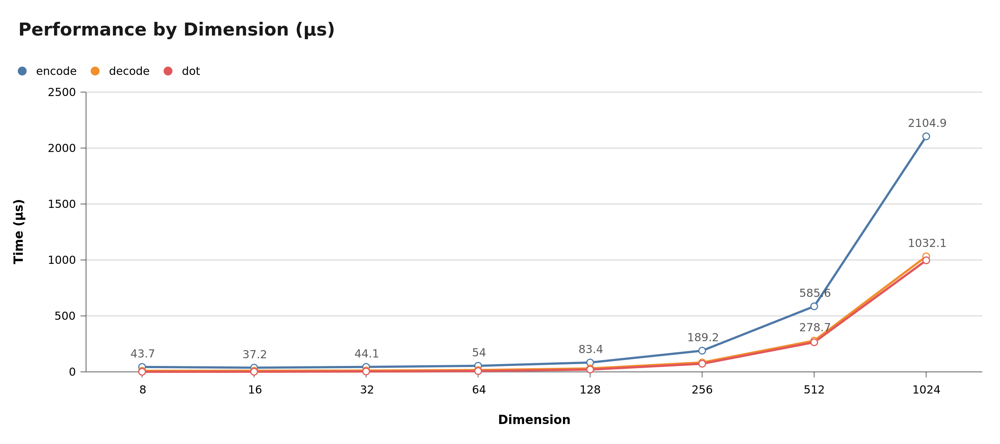
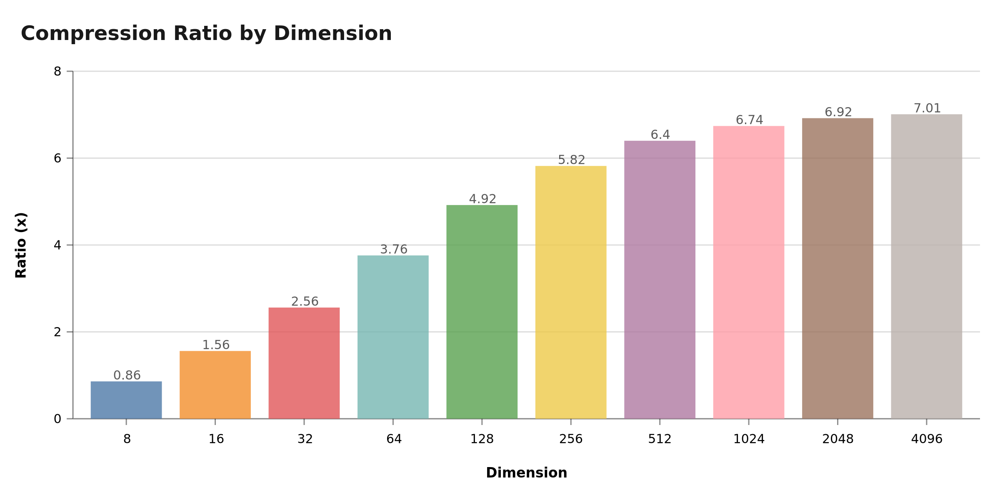
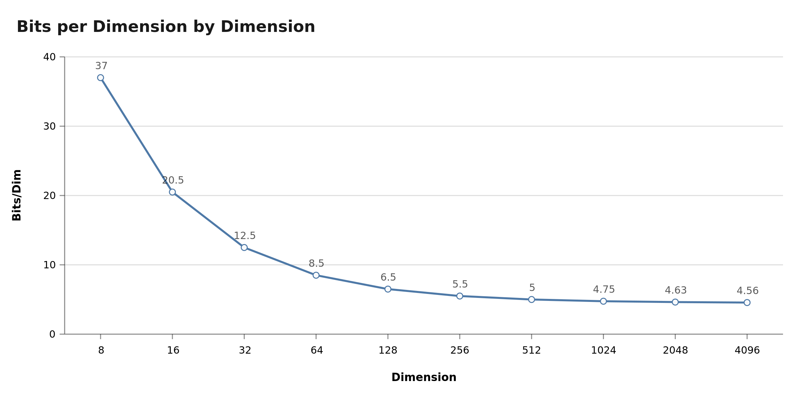

# TurboQuant

A Zig implementation of Google's TurboQuant vector compression library based on the paper "TurboQuant: Online Vector Quantization with Near-optimal Distortion Rate".

## Features

- **3 bits/dim compression** - Near 6x compression ratio for typical vectors
- **Fast dot product** - Estimate inner products without full decode
- **QJL** - Quantized Johnson-Lindenstrauss for unbiased inner product estimation
- **SIMD optimized** - Uses Zig's portable `@Vector` for ARM64 NEON
- **Engine-based API** - Precompute state for repeated operations

## Quick Start

```zig
const turboquant = @import("turboquant");

// Create an engine for repeated operations
var engine = try turboquant.Engine.init(allocator, .{ .dim = 1024, .seed = 12345 });
defer engine.deinit(allocator);

// Encode a vector
const compressed = try engine.encode(allocator, my_vector);
defer allocator.free(compressed);

// Decode it back
const decoded = try engine.decode(allocator, compressed);
defer allocator.free(decoded);

// Fast dot product without full decode
const score = engine.dot(query_vector, compressed);
```

## API

```zig
pub const EngineConfig = struct {
    dim: usize,
    seed: u32,
};

pub const Engine = struct {
    pub fn init(allocator: std.mem.Allocator, config: EngineConfig) !Engine
    pub fn deinit(e: *Engine, allocator: std.mem.Allocator) void
    pub fn encode(e: *Engine, allocator: std.mem.Allocator, x: []const f32) ![]u8
    pub fn decode(e: *Engine, allocator: std.mem.Allocator, compressed: []const u8) ![]f32
    pub fn dot(e: *Engine, q: []const f32, compressed: []const u8) f32
};
```

## Performance



| Dim | encode | decode | dot |
|-----|--------|--------|-----|
| 256 | 189 µs | 84 µs | 73 µs |
| 512 | 586 µs | 279 µs | 265 µs |
| 1024 | 2105 µs | 1032 µs | 997 µs |

## Compression





## Star Growth


## Building

```bash
cd turboquant
zig build-exe -O ReleaseFast -target aarch64-macos-none src/profile.zig
```

## Binary Format

```
Header (23 bytes):
- version: u8
- dim: u32
- reserved: u8 (2 bytes)
- polar_bytes: u32
- qjl_bytes: u32
- max_r: f32
- gamma: f32

Payload:
- polar encoded data (variable)
- qjl encoded data (variable)
```

## License

MIT
